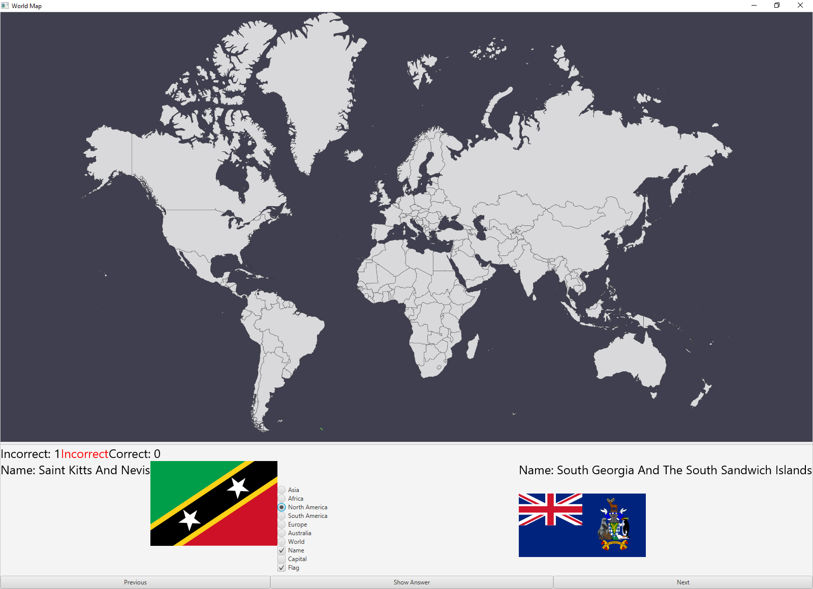

# geoquiz
Interactive Geography Quiz

Quizzes a user on country flags, names, and
locations.

Uses HanSolo's [worldfx](https://github.com/HanSolo/worldfx)
for the world map and hjnilsson's 
[country-flags](https://github.com/hjnilsson/country-flags)
for flag images.

